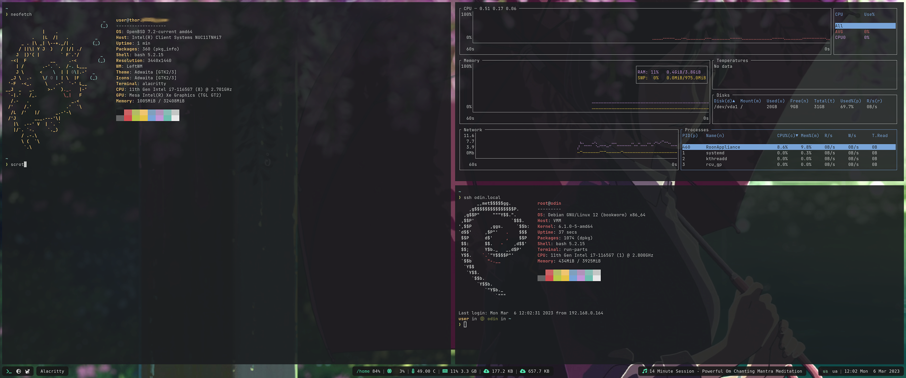

# Oatbar - standalone desktop bar

[](https://crates.io/crates/oatbar)


[](main.png)

The motivation for creation of `oatbar` was to extend on the idea of Unix-way for toolbars.
Inspired by `i3bar` which consumes a JSON stream that controls it's appearance, we take this
idea much further without becoming a DIY widget toolkit.

JSON, CSV or plain text streams can be turned into text panels, progress bars or even images without
any significant coding effort.

| Feature | **`oatbar`** | Basic bars | Bars with built-in plugins | DIY toolbar kits |
|---------|:-------:|:-----:|:----:|:------:|
| [Built-in system data](configuration/cookbook/data.md) | **✅** | **✅** | **✅** | - |
| [Text widgets from custom data](configuration/block.md#text-block) | **✅** | **✅** | **✅** | **✅** |
| [Advanced widgets](configuration/block.md) | **✅** | **✅** | - | **✅** |
| [Advanced widgets with data from a custom script](configuration/block.md) | **✅** | - | - | **✅** |
| [Display image files from a custom script](configuration/block.md#image-block) | **✅** | - | - | **✅** |
| [Generate images dynamically in a custom script](configuration/cookbook/advanced.md#dynamic-image-block) | **✅** | - | - | **✅** |
| [Control all appearance from a custom script](cookbook/appearance.md) | **✅** | - | - | **✅** |
| [Minimal coding](#example) | **✅** | **✅** | **✅** | - |
| [Built-in plugins have no appearance advantage over custom scripts](configuration/cookbook/data.md#common-blocks) | **✅** | - | - | **✅** |
| [Unix-way input via pipes means customization programming language is not forced upon you](configuration/command) | **✅** | **✅** | **✅** | - |
## Example

```toml
[[bar]]
height=32
blocks_left=["workspace"]
blocks_right=["clock"]

[[command]]
name="clock"
command="date '+%a %b %e %H:%M:%S'"
interval=1

[[command]]
name="desktop"
command="oatbar-desktop"

[[block]]
name = 'workspace'
type = 'enum'
active = '${desktop:workspace.active}'
variants = '${desktop:workspace.variants}'
on_mouse_left = "oatbar-desktop $BLOCK_INDEX"

[[block]]
name = 'clock'
type = 'text'
value = '${clock:value}'
```

Here `clock` command sends plain text, but `desktop` streams
structured data in JSON. Each is connected to text and enum selector
widgets respectively. `oatbar-desktop` ships with `oatbar`, but it is an external tool
to a bar, as can be replaced your own script. 

Feel free to run `oatbar-desktop` and investigate it's output. `oatbar` consumes
[multiple text formats](configuration/command.md#formats) and this data can be
displayed with minimal configuration on widgets called [blocks](configuration/block.md).

## Next Steps

* [Installation](./installation.md)

* [Configuration](./configuration)
