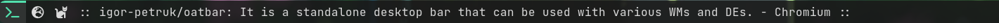

# Oatbar

[](https://crates.io/crates/oatbar)


`Oatbar` a standalone desktop bar that can be used with various WMs and DEs focused
on customizability.




[](main.png)

If you have experience with bars like `i3bar`, you are familiar with the protocols 
through which bar plugins stream data to be displayed on the bar. 

The usual format is text with some formatting capabilities. More complex widgets like
progress bars, selections or images are usually limited to built-in modules. 
Other bars choose the opposite approach and function exsentialy as widget toolkits.

`Oatbar` combines the best of both worlds

* Embrace text formats popular in the ecosystem 
* Represent custom data in various widgets without coding
* Provide plugins to support common tasks

Example:

```toml
[[bar]]
height=32
blocks_left=["workspace"]
blocks_right=["clock"]

[[command]]
name="clock"
command="date '+%a %b %e %H:%M:%S'"
interval=1

[[command]]
name="desktop"
command="oatbar-desktop"

[[block]]
name = 'workspace'
type = 'enum'
active = '${desktop:workspace.active}'
variants = '${desktop:workspace.variants}'
on_mouse_left = "oatbar-desktop $BLOCK_INDEX"

[[block]]
name = 'clock'
type = 'text'
value = '${clock:value}'
```

Here `clock` command sends plain text, but `desktop` streams
structured data in JSON. Both are connected to text and selector
widgets. `desktop` ships with `oatbar`, but it is an external tool
to the bar, as can be your script.

## Next Steps

* [Installation](./installation.md)

* [Configuration](./configuration)
