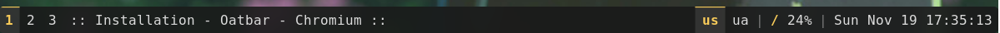

# Overview

The configuration for the `oatbar` is located at `~/.config/oatbar/config.toml`. If you do
not have this file, it would be generated with reasonable defaults.

Proceed to [concepts](./concepts.md) to learn basic building blocks
of `oatbar` configuration.

Proceed to [cookbook](./cookbook/) if you are familiar with concepts and you are looking for a _recipe_ to solve a particular problem, proceed to
the particular problem.

You can also use an AI assistant with the [MCP server](./cookbook/mcp.md) to configure the bar
interactively — it can read and edit your config, inspect live variables, and restart oatbar
without any manual steps.

The configuration is unstable.

Until 1.0 release, the configuration change is unstable and
can change between minor releases. Community feedback is needed
to make sure that when configuration stabilizes, it is the best
possible.

