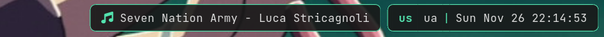

# Block

Blocks are the widgets displaying pieces of information on the bar.

`oatbar` provides a lot of hidden power via these widgets, as they can provide
more than they initially seem. Consider that the most of the string properties
of blocks support variable substitution, directly controlled by your scripts.

The reference below explains properties of these blocks and the
[Cookbook](./cookbook/) shows how to use them in a very clever way.

<!-- toc -->

## Common properties

```toml
[[block]]
# Name used as a reference 
name="block-name"

# Main input for the block.
value="<b>Clock:</b> ${clock:value}"

# A series of regex replacements that
# are applied to `value`.
# See https://docs.rs/regex/latest/regex/
replace=[
  ["^1$","www"],
  ["^2$","term"]
]
# If true, stop applying replaces after one row matches.
# If false, keep applying replaces to the end.
replace_first_match=false

# If set, formats the final value contents after all processing and transformations
# like regex replacements or progress bar rendering.
# Not supported by image blocks.
output_format="cpu: ${value}"

# If true (default), full Pango markup is supported.
# https://docs.gtk.org/Pango/pango_markup.html
# It may be desirable to turn it off if input has
# HTML-like text to be displayed.
pango_markup=true

# List of pairs [expression, regex].
# Show the block only if all expressions match respective regexes.
show_if_matches=[["${clock:value}",'.+']]

# If set, and the bar has popup=true, then this block
# can pop up.
#   - block - the block itself pops up
#   - partial_bar - the partial bar pops up
#   - bar - the entire bar pops up.
# The surrounding separators will appear as appropriate.
popup="partial_bar"
# If unset, the popup is triggered by any property change.
# If set, the popup is triggered by change of this property.
popup_value="${clock:value}"

# Font and size of the text in the block.
font="Iosevka 14"

# Base RGBA colors of the blocks.
background="#101010bb"
foreground="#ffff00"

# Properties of lines around the block, if set.
overline_color="#..."
underline_color="#..."
edgeline_color="#..."
line_width=0.4

# Margin and padding of the block within a bar.
margin=3.0
padding=5.0

# A command to run on a particular mouse event.
# It is run with `sh -c "..."` and the process will be detached from oatbar.
# BLOCK_NAME and BLOCK_VALUE environment variables are set.
# For `enum` blocks, BLOCK_INDEX is set too.
on_mouse_left = 'chrome'
on_mouse_middle = 'chrome'
on_mouse_right = 'chrome'
on_scroll_up = 'chrome'
on_scroll_down = 'chrome'
```

To avoid repetition, consider using `default_block`, that
supports all common properties.

```toml
[[default_block]]
background="#202020"
```

Multiple named `default_block` sections can be used.

```toml
[[default_block]]
name="ws1_widgets"

[[block]]
inherit="ws1_widgets"
```

## Text block

```toml
[[block]]
type="text"
```

Text blocks include all common properties, which should be enough to show
basic text or icons using [Pango markup](https://docs.gtk.org/Pango/pango_markup.html),
 icon fonts such as [Font Awesome](https://fontawesome.com/),
[Nerd Fonts](https://www.nerdfonts.com/), [IcoMoon](https://icomoon.io/) or emojis.

In addition, text blocks are used as separators to create **partial bars**.
They are smaller bars within a bar that groups multiple blocks together.



```toml
[[bar]]
blocks_right=["L", "music", "R", "E", "L", "layout", "S", "clock", "R"]

[[block]]
name="music"
...
show_if_matches = [['${player:now_playing.full_text}', '.+']]
popup = "partial_bar"

[[block]]
name="S"
type = "text"
separator_type = "gap"
value = "|"

[[block]]
name="E"
type = "text"
separator_type = "gap"
value = " "
background = "#00000000"

[[block]]
name="L"
type = "text"
separator_type = "left"
separator_radius = 8.0

[[block]]
name="R"
type = "text"
separator_type = "right"
separator_radius = 8.0
```

`separator_type` gives a hint on where partial bars are located.
This helps when `popup="partial_bar"`. It also helps to collapse
unnecessary separators when normal blocks around them are hidden.

## Number block

```toml
[[block]]
type="number"
```

Number can be displayed as text on the text block. But the real
value comes when the bar understands that the data is a number.

In addition to common properties, the number blocks 
support unit conversions and alternative forms of display,
such as progress bars.

```toml
# Min/max values are used in progress bars.
# They are set as string because they support
# variable substituion and can be specified in units.
min_value="0"
max_value="1000"

# A number type that input represents.
#  - number - a number from min to max
#  - percent - a number from 0 to 100, '%' is ommitted from the input when parsing.
#  - bytes - a number that supports byte unit suffixes, e.g. "GB", "kb",
#      - See https://docs.rs/bytesize/latest/bytesize/
number_type="percent"

# A sorted list of ramp formats. If set, prior to wrapping with `output_format`,
# wrap to the format from the entry larger than `value`.
ramp = [
  ["80%", "<span foreground='yellow'>${value}</span>"],
  ["90%", "<span foreground='red'>${value}</span>"],
]
```

`number_display` can be used to select the widget that is going to display your
number on the block.

### Number as text

You can display the number as text as you would have with a `text` block, but there
is a benefit of additional functionality, such as unit conversions and ramp
functionality.


```toml
[[block]]
type="number"
name="cpu"
...
number_display="progress_bar"
```

### Progress bar

```toml
[[block]]
type="number"
name="cpu"
...
number_display="progress_bar"
# How many characters to use for the progress bar.
progress_bar_size=10
# Progress bar characters. In this example would render: "━━━━雷     "
empty=" "
fill="━"
indicator="雷"
# Each of the above can be a ramp
# fill = [
#  ["", "━"],
#  ["60%", "<span foreground='yellow'>━</span>"],
#  ["90%", "<span foreground='red'>━</span>"],
# ]
```

## Enum block

```toml
[[block]]
type="enum"
```

Enum is different from text block as it renders multiple child text blocks called
`variants`, only one of which is `active`. *Example:* keyboard layout switch.

Almost every common property related to block display has an `active_` counterpart
to configure an active block. For example `background` and `active_background`.

```toml
# A separated list of variants, e.g. "ua,se,us".
variants = '${keyboard:layout.variants}'
# An index of the item that is to be active starting from 0.
active = '${keyboard:layout.active}'
# A separator for the variants list. Default: ",".
enum_separator="|"
```

Text processing via `replace` is done per item of the `variants` separately,
not together. If an variant becomes empty as a result of processing, it will
not be displayed, but it won't impact the meaning of `active` index.

`BLOCK_INDEX` environment variable set for `on_mouse_left` command is set to
the index of the variant that was clicked on.

## Image block

```toml
[[block]]
type="image"
```

In image blocks, the `value` property is interpreted as and image file name to be
rendered. Supported formats: BMP, ICO, JPEG, PNG, SVG, WEBP.

```
# If set, can shrink the image smaller than automatically determined size.
max_image_height=20
# If this value is set and changed, then image caching gets disabled and
# image is reloaded from the filesystem even if the filename stayed the same.
# It can be used by a command to generate dynamic images under the same filename.
updater_value="${image_generator:timestamp}"
```

The block offers rich possibilities, provided you can generate your own
images or download them from the Internet on flight in the command that generates
a filename.
