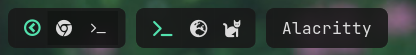

# Advanced

Let's build something complex with what `oatbar` has to offer.

<!-- toc -->

## Menu

`oatbar` does not support menus, but let's build one.




```toml
[[bar]]
blocks_left=["L", "menu", "S", "launch_chrome", "launch_terminal", "R"]

[[block]]
name='menu'
type = 'text'
value = "${show_menu}"
replace = [
   ["^$", "circle-right"],
   ["show", "circle-left"],
   ["(.+)","<span font='IcoMoon-Free 12' weight='bold' color='#53e2ae'>$1</span>"],
]
on_click_command = "oatctl var rotate show_menu right '' show &"

[[block]]
name='launch_chrome'
type = 'text'
value = "<span font='IcoMoon-Free 12'></span> "
show_if_set="${show_menu}"
on_click_command = "oatctl var set show_menu ''; chrome &"

[[block]]
name='launch_terminal'
type = 'text'
value = "<span font='IcoMoon-Free 12'></span> "
show_if_set="${show_menu}"
on_click_command = "oatctl var set show_menu ''; alacritty &"
```

Let's take a closer look:

1. We create a `show_menu` variable that can be empty or set to `show`
1. In `menu` block all regexes apply in sequence.
1. The first two replace it with icon names. 
1. The last one wraps the icon name into the final Pango markup.
1. The `on_click_command` rotates the values of `show_menu` between empty and `show`, effectively toggling it.
1. Blocks are only displayed if `show_menu` is set.
1. Blocks clear `show_menu` before launching the app to hide the menu.
