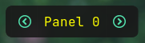
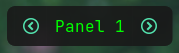
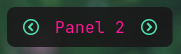

# Advanced examples

Let's build something complex with what `oatbar` has to offer. 

<!-- toc -->

Combination of variables, visibility control and programmatic access to variables via `oatctl var` provides
tremendous power.

In these examples `oatctl var` is often called from `on_click_command` handlers, but you
can use it in your WM keybindings too.

## Workspace customizations

If you have enabled `oatbar-desktop` command, you should have access to the `${desktop:workspace.value}`
variable.

```toml
[[command]]
name="desktop"
command="oatbar-desktop"
```

See which values it can have via `oatctl var ls | grep desktop` when running `oatbar`. You can use
this to set any properties of your block, including appearance and visibility.

### Appearance

In this example, the bar on workspace `two` is a bit more red than usual.

```toml
[[var]]
name="default_block_bg"
value="${desktop:workspace.value}"
replace_first_match=true
replace=[
  ["^two$","#301919e6"],
  [".*", "#191919e6"],
]

[[default_block]]
background="${default_block_bg}"
```

### Visibility

This block shown only on workspace `three`.

```toml
[[block]]
show_if_matches=[["${desktop:workspace.value}", "^three$"]]
```

## Menu

`oatbar` does not know anything about menus, but let's build one.


```toml
[[bar]]
blocks_left=["L", "menu", "launch_chrome", "launch_terminal", "R"]

[[default_block]]
background="#191919e6"

[[default_block]]
name="menu_child"
background="#111111e6"
line_width=3
overline_color="#191919e6"
underline_color="#191919e6"
show_if_matches=[["${show_menu}","show"]]

[[block]]
name='menu'
type = 'text'
value = "${show_menu}"
replace = [
   ["^$", "circle-right"],
   ["show", "circle-left"],
   ["(.+)","<span font='IcoMoon-Free 12' weight='bold' color='#53e2ae'>$1</span>"],
]
on_click_command = "oatctl var rotate show_menu right '' show"

[[block]]
name='launch_chrome'
type = 'text'
inherit="menu_child"
value = "<span font='IcoMoon-Free 12'></span> "
on_click_command = "oatctl var set show_menu ''; chrome"

[[block]]
name='launch_terminal'
type = 'text'
inherit="menu_child"
value = "<span font='IcoMoon-Free 12'></span> "
on_click_command = "oatctl var set show_menu ''; alacritty"
```

Let's take a closer look:

1. We create a `show_menu` variable that can be empty or set to `show`
1. In `menu` block all regexes apply in sequence.
1. The first two replace it with icon names. 
1. The last one wraps the icon name into the final Pango markup.
1. The `on_click_command` rotates the values of `show_menu` between empty and `show`, effectively toggling it.
1. Blocks are only displayed if `show_menu` is set.
1. Blocks clear `show_menu` before launching the app to hide the menu.
1. A small cosmetic effect is achieved by inheriting a `default_block` with a different style.

This example can be extended to build more layers of nesting by introducing additional variables.

## Rotating menu

It sometimes useful to always show the main panel, but have an occasional access to additional
information. A great idea would be to build a rotating menu.

 &nbsp;
 &nbsp;


```toml
[[bar]]
blocks_left=["L", "rotate_left", "panel_0", "panel_1", "panel_2", "rotate_right", "R"]

[[block]]
name='rotate_left'
type = 'text'
value = "<span font='IcoMoon-Free 12' color='#53e2ae'>circle-left</span>"
on_click_command = "oatctl var rotate rotation_idx left '' 1 2"

[[block]]
name='rotate_right'
type = 'text'
value = "<span font='IcoMoon-Free 12' color='#53e2ae'>circle-right</span>"
on_click_command = "oatctl var rotate rotation_idx right '' 1 2"

[[block]]
name='panel_0'
type = 'text'
value = "<span color='yellow'>Panel 0</span>"
show_if_matches=[["${rotation_idx}", "^$"]]

[[block]]
name='panel_1'
type = 'text'
value = "<span color='lime'>Panel 1</span>"
show_if_matches=[["${rotation_idx}", "1"]]

[[block]]
name='panel_2'
type = 'text'
value = "<span color='deeppink'>Panel 2</span>"
show_if_matches=[["${rotation_idx}", "2"]]
```
