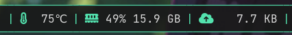
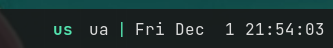
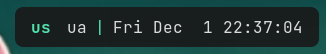
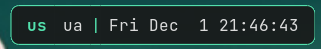
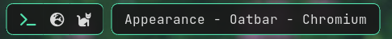
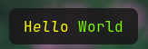
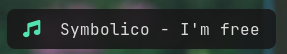
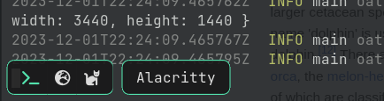

# Appearance

This section focuses on recipes on how to display the data from your sources.

<!-- toc -->

## Separators

### Simple separator



Separator is just a text block.

```toml
[[bar]]
blocks_left=["foo", "S", "bar", "S", "baz"]

[[block]]
name="S"
type = 'text'
separator_type = 'gap'
value = '|'
foreground = "#53e2ae"
```
 
This approach offers maximum flexibility: 
* Multiple separator types and styles
* Dynamically separators based on conditions
* Disappearing separators via `show_if_matches`

Specifying `separator_type = "gap"` is recommended. It gives `oatbar` a hint that the block is
a separator. For example multiple separators in a row do not make sense and
they will collapse if real blocks between them become hidden.

### Empty space around bar

By default `oatbar` looks more traditional.



You can apply margins and border-lines to achieve some empty space around your bar.



```toml
[[bar]]
blocks_right=["L", "layout", "S", "clock", "R"]
# `top` may need a value or must be zero depening on your WM.
margin={left=8, right=8, top=0, bottom=8}
# Alpha channels is zero, so the bar is transparent unless there is has a block.
background="#00000000"

[[default_block]]
# The actual block color.
background="#191919e6"

[[block]]
name='L'
type = 'text'
separator_type = 'left'
separator_radius = 8.0

[[block]]
name='R'
type = 'text'
separator_type = 'right'
separator_radius = 8.0
```

### Border lines



```toml
# Or per [[block]] separately.
[[default_block]]
edgeline_color = "#53e2ae"
overline_color = "#53e2ae"
underline_color = "#53e2ae"

# edgeline applies to `left` and `right` blocks.
[[block]]
name='L'
type = 'text'
separator_type = 'left'
separator_radius = 8.0

[[block]]
name='R'
type = 'text'
separator_type = 'right'
separator_radius = 8.0
```


### Partial bar

Bars of `oatbar` can be further separated to small partial bars. It is possible
to by further use of `L` and `R` bars and addition of completely transparent `E` block.



```toml
[[bar]]
blocks_left=["L", "workspace", "R", "E", "L", "active_window", "R"]

[[block]]
name="E"
type = 'text'
separator_type = 'gap'
value = ' '
background = "#00000000"
# If you have set these in [[default_block]], reset them back.
edgeline_color = ""
overline_color = ""
underline_color = ""
```

Setting `separator_type` correctly for all separators will make partial panel
disappearing if all real blocks are hidden via `show_if_matches`.

## Blocks

### Pango markup

`oatbar` supports full [Pango Markup](https://docs.gtk.org/Pango/pango_markup.html)
as a main tool to format the block content. Command can emit Pango markup too, controlling
the appearance of the blocks.



```toml
[[block]]
name='pango'
type = 'text'
value = "<span text_transform='capitalize' color='yellow'>h<i>ell</i>o</span> <span color='lawngreen'>World</span>"
```

Font names to be used in Pango can be looked up via the `fc-list` command.

### Icons

Use icon fonts such as [Font Awesome](https://fontawesome.com/),
[Nerd Fonts](https://www.nerdfonts.com/), [IcoMoon](https://icomoon.io/) or emojis.



```toml
[[block]]
name='pango'
type = 'text'
value = "<span ${green_icon}></span>  Symbolico - I'm free"

[[var]]
name="green_icon"
value="font='Font Awesome 6 Free 13' foreground='#53e2ae'"
```

Some icon fonts use ligatures instead of emojis, replacing words with icons like this:

```toml
value = "<span ${green_icon}>music</span>  Symbolico - I'm free"
```

If your icon does not perfectly vertically align with your text, experiment with font size and `rise` Pango parameter.

### Visibility

`show_if_matches` combined with a powerful tool to build dynamic bars. 
Here it is used to only show the block if the value is not empty.

```toml
[block]
value = '${desktop:window_title.value}'
show_if_matches = [['${desktop:window_title.value}', '.+']]
```

Custom variables, not only those coming from commands can be used. They can be
set via `oatctl var set`, opening a huge number of possibilities. See some examples in
the [Advanced](./advanced.md) chapter.

If you are not an expert in regular expressions, here are some useful ones:

|  Regex  |   Meaning |
|---------|-----------|
|  `foo`   |  Contains `foo` |
|  `^foo`   |  Starts with `foo` |
|  `foo$`   |  Ends with `foo` |
|  `^foo$`   |  Exactly `foo` |
|  `^$`   |  Empty string |
|  `.+`    | Non empty string |
| <code>(foo&#124;bar&#124;baz)</code> | Contains one of those words |
| <code>^(foo&#124;bar&#124;baz)$</code> | Exactly one of those words |

In the examples above `foo` works because it only contains alpha-numeric characters,
but be careful with including characters that have special meaning in regular expressions.
For more info read `regex` crate [documentation](https://docs.rs/regex/latest/regex/#syntax).

## Popup bars

A bar can be hidden and appear when certain conditions are met.

```toml
[[bar]]
popup=true
```

Popup bars appear on the top of the windows, unlike normal bars that
allocate dedicated space on the screen.



### Popup at cursor

Popup bar can be shown when the cursor approaches the screen edge where the bar is located.

```toml
[[bar]]
popup=true
popup_at_edge=true  
```

### Temporary popup on block change

When *any property* of the block changes you can make it appear. Depending on a `popup`
value you can show enclosing partial or entire bar.

```toml
[[bar]]
popup="bar"
#popup="partial_bar"
#popup="block"
```

If you won't want to popup on any property change, you can limit it to one expression.

```toml
[[bar]]
popup_value="${foo}"
```

Example layout switcher that appears in the middle of the screen when you change your layout.

```toml
[[bar]]
blocks_center=["L", "layout_enum_center", "R"]
background="#00000000"
popup=true
position="center"

[[block]]
name = 'layout_enum_center'
type = 'enum'
active = '${keyboard:layout.active}'
variants = '${keyboard:layout.variants}'
popup = "block"
```
