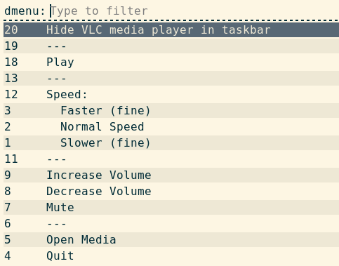

# Tray

`oatbar` supports modern System Trays via the standard **[Status Notifier Item (SNI)](https://www.freedesktop.org/wiki/Specifications/StatusNotifierItem/)** protocol. Because it is built on SNI, trays work seamlessly across both X11 and Wayland environments.


> **Legacy xembed support:** `oatbar` does not support the older X11 `xembed` tray protocol. If you use legacy applications that require `xembed`, run the third-party `xembedsniproxy` daemon to bridge them to the SNI protocol.

### How it Works

Unlike traditional desktop bars, `oatbar` doesn't have a hardcoded "system tray area". Trays are treated identically to regular blocks and variables.

When a tray application launches, the `oatbar-sni` protocol server extracts its pixel buffers and actions into standard variables. This gives you full control:
- **[Place trays anywhere:](#split-trays-across-different-bars)** Insert tray icons individually anywhere in your layout.
- **[Split them up:](#split-trays-across-different-bars)** Move different trays to completely different blocks or bars.
- **[Filter by monitor:](#split-trays-across-different-bars)** Conditionally show specific apps only on certain monitors.
- **[Custom icons & text:](#replace-tray-icon-with-custom-text)** Ignore the app's native `pixmap` and substitute your own images, font icons, or text.
- **[Programmatic menu actions:](#blocks-to-click-menu-items)** Create dedicated buttons that click specific context menu items by name — no interactive menu needed.

### Configuration Guide

#### 1. Enable the SNI Protocol Server

Add the `oatbar-sni` command to your `~/.config/oatbar/config.toml`:

```toml
[[command]]
name="sni"
command="oatbar-sni"
```

#### 2. Discover Tray App IDs

Each tray block maps to one application. You need to find the identifier that the app registers under.

Launch the application you want to configure (e.g., `vlc`), then query the active variables:

```bash
oatctl var ls | grep sni | grep visible
```

You should see output like:
```text
sni.vlc.visible
sni.Pidgin.visible
sni.chrome_status_icon_1.visible
sni.nm-tray.visible
```

The string after `sni.` is the app identifier (e.g., `vlc`, `Pidgin`). Note that some apps like Chrome use dynamic identifiers such as `chrome_status_icon_1`.

#### 3. Add a Tray Block

Create an Image block binding to the app's variables. Hook all `on_mouse_*` events to `oatbar-sni activate` to forward clicks to the tray application:

```toml
[[block]]
name="tray_vlc"
type="image"
pixmap="${sni:sni.vlc.pixmap}"
show_if_matches=[['${sni:sni.vlc.visible}', '1']]
max_image_height=20
on_mouse_left="oatbar-sni activate ${sni:sni.vlc.dbus} left $ABS_X $ABS_Y"
on_mouse_middle="oatbar-sni activate ${sni:sni.vlc.dbus} middle $ABS_X $ABS_Y"
on_mouse_right="oatbar-sni activate ${sni:sni.vlc.dbus} right $ABS_X $ABS_Y"
```

Then add your tray blocks to the bar layout:

```toml
[[bar]]
blocks_right=["L", "tray_vlc", "clock_pill", "R"]
```

Repeat for every tray app you use, replacing the identifier from step 2.

### Recipes

> `oatbar` doesn't treat tray blocks specially — they are regular blocks. Any property can be omitted, overridden, or replaced with your own values.

#### Replace Tray Icon with Custom Text

Since a tray block is just a block, you can use `type="text"` instead of `type="image"` and ignore the pixmap entirely. Only the `visible` variable and click handlers reference SNI:

```toml
[[block]]
name="tray_vlc"
type="text"
value="<span foreground='#89b4fa'>🎵 VLC</span>"
show_if_matches=[['${sni:sni.vlc.visible}', '1']]
on_mouse_left="oatbar-sni activate ${sni:sni.vlc.dbus} left $ABS_X $ABS_Y"
on_mouse_right="oatbar-sni activate ${sni:sni.vlc.dbus} right $ABS_X $ABS_Y"
```

#### Replace Tray Icon with a Custom Image

Use a static image file instead of the app-provided pixmap:

```toml
[[block]]
name="tray_discord"
type="image"
value="/home/user/.config/oatbar/icons/discord.png"
show_if_matches=[['${sni:sni.chrome_status_icon_1.visible}', '1']]
max_image_height=20
on_mouse_left="oatbar-sni activate ${sni:sni.chrome_status_icon_1.dbus} left $ABS_X $ABS_Y"
```

#### Split Trays Across Different Bars

Place specific trays on different bars or monitors. Each tray block is independent:

```toml
# Primary monitor bar
[[bar]]
monitor="eDP-1"
blocks_right=["L", "tray_vlc", "tray_pidgin", "clock_pill", "R"]

# External monitor bar — only show network manager
[[bar]]
monitor="HDMI-A-1"
blocks_right=["L", "tray_nm", "clock_pill", "R"]
```

#### Customizing Context Menus

Some tray applications export their right-click context menus over DBus, relying on the bar to display them.

`oatbar` defaults to rendering these menus using **rofi**. Delegating to external search launchers like this provides a unique advantage: you can instantly use your keyboard to search, filter, and select through complex nested tray menus.



You can replace the default with any `dmenu`-compatible tool via `~/.config/oatbar/sni.toml`:

*Wayland (Wofi)*
```toml
# ~/.config/oatbar/sni.toml
dbusmenu_display_cmd = "wofi --dmenu"
```

*X11 (dmenu)*
```toml
# ~/.config/oatbar/sni.toml
dbusmenu_display_cmd = "dmenu -l 100"
```

#### Blocks to click menu items

Since `oatbar-sni` can click menu items directly via `dbusmenu item-click`, you can create dedicated bar buttons that trigger specific menu actions — no right-click menu needed. This works for applications that export their menus over the [DBusMenu protocol](../reference/tray.md#context-menus-dbusmenu-protocol).

For example, create a "Mute" button that only appears when VLC is running:

```toml
[[block]]
name="vlc_mute"
type="text"
value="🔇 Mute"
show_if_matches=[['${sni:sni.vlc.visible}', '1']]
on_mouse_left="oatbar-sni dbusmenu item-click ${sni:sni.vlc.dbus} --regex 'Mute'"
```

This is a regular text block that:
- Uses `sni.vlc.visible` to appear only while VLC is running — you don't even need a separate VLC tray icon block.
- Clicks a specific menu item by label regex on left-click, skipping the interactive menu entirely.

Use `oatbar-sni dbusmenu print` to discover available menu labels:
```bash
oatbar-sni dbusmenu print $(oatctl var get sni:sni.vlc.dbus)
```

See the [Reference](../reference/tray.md#dbusmenu-cli-commands) for full `dbusmenu` command details.

#### Keyboard shortcuts for tray menus

Because `oatbar` exposes variables via `oatctl`, you can bind keyboard shortcuts in your window manager to interact with tray applications directly. By combining `oatctl var get` to fetch the dynamic DBus path with `oatbar-sni`,
and `rofi` you can invoke menus or click specific items without using the mouse.

Here is an example using `i3wm`/`sway` configuration syntax to control VLC:

```text
# ~/.config/i3/config

# Press Super+V to display VLC's right-click context menu (via rofi/dmenu)
bindsym $mod+v exec oatbar-sni activate $(oatctl var get sni:sni.vlc.dbus) right 0 0

# Press Super+M to directly click "Mute" in VLC's context menu, skipping the UI
bindsym $mod+m exec oatbar-sni dbusmenu item-click $(oatctl var get sni:sni.vlc.dbus) --regex 'Mute'
```

This works identically to the on-click actions in bar blocks, but relies on your window manager for the trigger.
